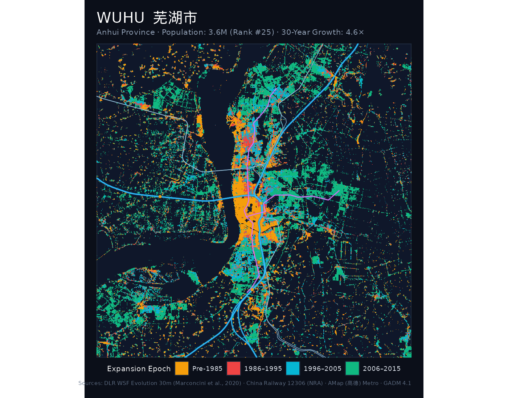
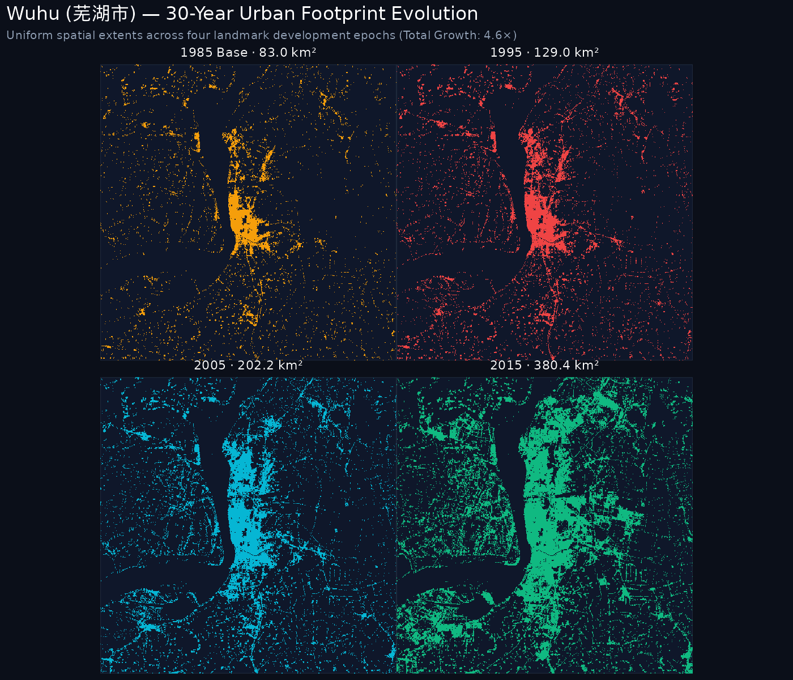
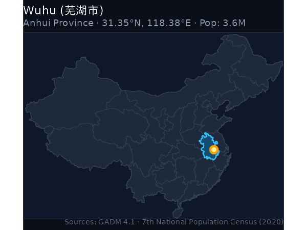
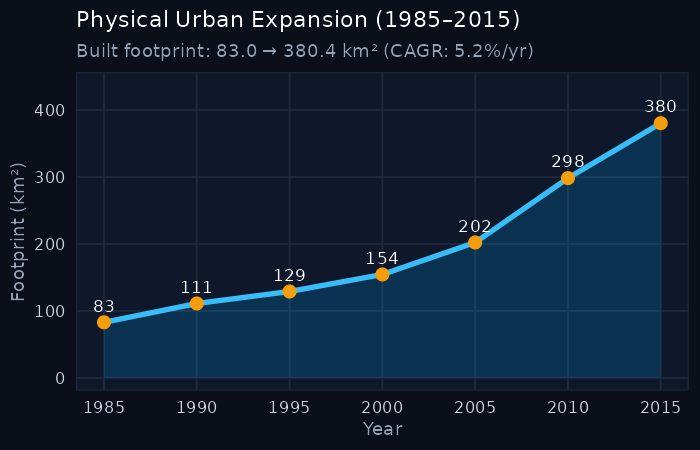

```{=html}
<div class="hero-banner">
  <div style="display: flex; justify-content: space-between; align-items: flex-start; flex-wrap: wrap; gap: 1rem;">
    <div>
      <h1 style="color: #ffffff; margin-bottom: 0.25rem;">Wuhu <span style="color: #f59e0b; font-weight: normal;">芜湖市</span> <span class="metric-badge badge-blue" style="font-size: 0.85rem; margin-left: 0.5rem;">🚇 2 Metro Lines</span></h1>
      <p style="color: #94a3b8; font-size: 1.1rem; margin: 0;">Wúhú · Anhui (安徽省) · Yangtze Delta & East</p>
      <p style="color: #cbd5e1; font-size: 0.95rem; margin-top: 0.35rem;">
        Population: <strong>3.64 Million</strong> (2020 Census) · 
        Population Rank: <strong>#25</strong> of 47 · 
        ArcGIS Urban Hierarchy Rank: <strong>N/A</strong>
      </p>
      <div style="margin-top: 0.75rem; display: flex; flex-wrap: wrap; gap: 0.5rem;">
        <a href="https://en.wikipedia.org/wiki/Wuhu" target="_blank" rel="noopener" class="resource-btn">📖 Wikipedia (EN)</a>
        <a href="https://zh.wikipedia.org/wiki/%E8%8A%9C%E6%B9%96%E5%B8%82" target="_blank" rel="noopener" class="resource-btn">🌐 维基百科 (ZH)</a>
        <a href="https://www.wikidata.org/wiki/Q359990" target="_blank" rel="noopener" class="resource-btn">🏷️ Wikidata (Q359990)</a>
        <a href="https://commons.wikimedia.org/wiki/Category%3AMaps%20of%20Wuhu" target="_blank" rel="noopener" class="resource-btn">🗺️ Commons Maps</a>
        <a href="https://commons.wikimedia.org/w/index.php?search=Wuhu+map&title=Special:MediaSearch&type=image" target="_blank" rel="noopener" class="resource-btn">🔍 Scanned Maps</a>
      </div>
    </div>
    <div style="text-align: right;">
      <span class="metric-badge badge-gold" style="font-size: 1.1rem; padding: 0.5rem 1rem;">4.59× Growth Multiplier</span>
    </div>
  </div>
</div>
```

## Key Urban Expansion & Hierarchy Indicators

::: {.metric-grid}
::: {.metric-card}
::: {.metric-label}
2020 Population
:::
::: {.metric-val}
3.64 <span style="font-size: 1rem; color: #94a3b8;">M</span>
:::
<div style="font-size: 0.8rem; color: #38bdf8;">Pop Rank #25 of 47</div>
:::

::: {.metric-card}
::: {.metric-label}
ArcGIS City Rank
:::
::: {.metric-val}
N/A
:::
<div style="font-size: 0.8rem; color: #94a3b8;">National Big Cities Tier</div>
:::

::: {.metric-card}
::: {.metric-label}
1985 Baseline Area
:::
::: {.metric-val}
82.97 <span style="font-size: 1rem; color: #94a3b8;">km²</span>
:::
:::

::: {.metric-card}
::: {.metric-label}
2015 Urban Footprint
:::
::: {.metric-val}
380.45 <span style="font-size: 1rem; color: #94a3b8;">km²</span>
:::
<div style="font-size: 0.8rem; color: #10b981;">+297.48 km²</div>
:::

::: {.metric-card}
::: {.metric-label}
Growth Multiple
:::
::: {.metric-val}
4.59×
:::
<div style="font-size: 0.8rem; color: #f59e0b;">Multiplier Rank #11</div>
:::

::: {.metric-card}
::: {.metric-label}
Annual Growth (CAGR)
:::
::: {.metric-val}
5.21%
:::
<div style="font-size: 0.8rem; color: #94a3b8;">1985–2015</div>
:::
:::

---

## 1. The Urban Growth Rings (1985–2015)

The cartographic poster below maps the physical settlement rings of **Wuhu** across four historical development epochs:

- <span style="color: #F59E0B; font-weight: bold;">● Pre-1985 Core</span>: Historic urban core and initial post-1949 industrial settlements.
- <span style="color: #EF4444; font-weight: bold;">● 1986–1995 Wave</span>: Early reform, opening up, and Deng Xiaoping's 1992 Southern Tour (*Nanxun*).
- <span style="color: #06B6D4; font-weight: bold;">● 1996–2005 Wave</span>: WTO entry, export industrialization, and new development zones (*Kaifaqu*).
- <span style="color: #10B981; font-weight: bold;">● 2006–2015 Wave</span>: High-speed rail expansion, modern new cities (*Xinqu*), and peri-urban consolidation.

::: {.map-container}

:::

::: {.callout-tip title="Rapid Transit & Municipal Metro Infrastructure"}
**Wuhu** operates an extensive urban rapid transit network comprising **2 operational metro lines** and **35 passenger stations** (source: AMap 高德地图 / Ministry of Transport of the PRC):

- **Key Metro Corridors**: `轨道交通1号线`, `轨道交通2号线`
- **Cartographic Overlay**: Prominently emphasized on the Hero poster above with a multi-layer luminous neon magenta/purple overlay and station nodes (`#A855F7` / `#E879F9`), illustrating how modern rapid transit corridors interconnect historical settlement cores with post-2000 peripheral development zones.
- **Transit Alignment**: High-frequency metro lines provide multi-directional connectivity between the historical core (Pre-1985 settlement) and outer-ring state-level expansion zones (*Kaifaqu* and *Xinqu*).
:::

---

## 2. Small Multiples: 4-Epoch Footprint Progression

Uniform-scale physical footprint progression maps tracking built-up settlement expansion over time:

::: {.map-container}

:::

---

## 3. Geographical Location & Growth Trajectory

:::: {.columns}

::: {.column width="48%"}
### Location in China
::: {.map-container}

:::
:::

::: {.column width="4%"}
:::

::: {.column width="48%"}
### 30-Year Expansion Curve
::: {.map-container}

:::
:::

::::

---

## 4. 5-Year Milestone Chronology

| Milestone Year | Urban Footprint (km²) | Growth vs. 1985 Baseline | Share of 2015 Footprint |
|:---:|:---:|:---:|:---:|
| **1985** | 82.97 km² | 1.00× (Baseline) | 21.8% |
| **1990** | 111.1 km² | 1.34× | 29.2% |
| **1995** | 129 km² | 1.55× | 33.9% |
| **2000** | 154.46 km² | 1.86× | 40.6% |
| **2005** | 202.25 km² | 2.44× | 53.2% |
| **2010** | 298.39 km² | 3.6× | 78.4% |
| **2015** | 380.45 km² | **4.59×** | 100.0% |

---

## 5. Archival Cartography & Wiki Resources

Direct links to open knowledge, semantic geodata, and scanned map collections for **Wuhu**:

- 📖 **English Wikipedia**: [Wuhu](https://en.wikipedia.org/wiki/Wuhu) — In-depth overview of history, urban development, demographic shifts, and regional governance.
- 🌐 **Chinese Wikipedia (中文维基百科)**: [芜湖市](https://zh.wikipedia.org/wiki/%E8%8A%9C%E6%B9%96%E5%B8%82) — Authoritative municipal boundaries, administrative subdivisions, and local transport infrastructure.
- 🏷️ **Wikidata Knowledge Base**: [Q359990 (Wuhu)](https://www.wikidata.org/wiki/Q359990) — Semantic knowledge graph entity with geocoordinates, OpenStreetMap tags, and linked administrative entities.
- 🗺️ **Wikimedia Commons Map Repository**: [Category:Maps of Wuhu](https://commons.wikimedia.org/wiki/Category%3AMaps%20of%20Wuhu) — Community-curated media repository containing thematic, administrative, and transport maps.
- 🔍 **Scanned Maps & Historical Sheets Search**: [Explore scanned bitmap and topographic maps of Wuhu on Wikimedia Commons](https://commons.wikimedia.org/w/index.php?search=Wuhu+map&title=Special:MediaSearch&type=image)

::: {.callout-note title="Selected Scanned Historical Maps on Wikimedia Commons"}
The following scanned historical maps and cartographic surveys covering **Wuhu** are accessible on Wikimedia Commons:

- [Location map of Wuhu, Anhui](https://commons.wikimedia.org/wiki/File%3ALocation%20map%20of%20Wuhu%2C%20Anhui.png) (Wikimedia Commons scanned asset)
- [Pelecanus philippensis map-big](https://commons.wikimedia.org/wiki/File%3APelecanus%20philippensis%20map-big.jpg) (Wikimedia Commons scanned asset)
- [Map of the Rail Transport Infrastructure in the Shanghai Region](https://commons.wikimedia.org/wiki/File%3AMap%20of%20the%20Rail%20Transport%20Infrastructure%20in%20the%20Shanghai%20Region.png) (Wikimedia Commons scanned asset)

Additional scanned historical maps and topographic sheets can be found via the [Wikimedia Commons Scanned Maps Search](https://commons.wikimedia.org/w/index.php?search=Wuhu+map&title=Special:MediaSearch&type=image).
:::

---

## 6. Data Sources & Attributions

The quantitative and spatial indicators for **Wuhu** are synthesized from the following primary sources:

1. **Urban Footprint & Built-Up Surface**: German Aerospace Center (DLR) [World Settlement Footprint Evolution (1985–2015)](https://download.geoservice.dlr.de/WSF_EVO/). 30m resolution multi-decadal satellite detection (*Marconcini et al., 2020, Nature Scientific Data*).
2. **Permanent Resident Population**: National Bureau of Statistics of China (NBS), [Seventh National Population Census (第七次全国人口普查 / 七普 2020)](http://www.stats.gov.cn/). Resident population: **3.64M** (National Rank: **#25** of 47).
3. **National Urban Tier Classification**: Esri / [ArcGIS Online Big Cities Points FeatureServer](https://services1.arcgis.com/4TXrdeWh0RyCqPgB/arcgis/rest/services/big_cities_points/FeatureServer), National City Rank: **N/A** of 184 major Chinese cities.
4. **National Railway & Municipal Transit**:
   - **National Passenger Rail Network**: China Railway (中国国家铁路集团 / 12306) and National Railway Administration of China (NRA), covering national high-speed corridors (PDL) and conventional trunk lines.
   - **Urban Subway Network**: AMap (高德地图) Subway Platform and PRC Ministry of Transport (MOT) Urban Rail Transit database (2 lines, 35 stations for Wuhu).
5. **Administrative Boundaries**: [GADM Database of Global Administrative Areas (v4.1)](https://gadm.org/), University of California, Davis.
6. **Archival Cartography & Encyclopedia Resources**: [Wikimedia Foundation](https://www.wikimedia.org/) ([Wikipedia](https://en.wikipedia.org/), [Wikidata](https://www.wikidata.org/), and [Wikimedia Commons](https://commons.wikimedia.org/)).

---

```{=html}
<div style="display: flex; justify-content: space-between; margin-top: 2rem; padding: 1rem; background: #111827; border-radius: 8px;">
  <a href="yichang.html" style="color: #38bdf8; text-decoration: none;">← Prev: Yichang (3.92M)</a>
  <a href="../regions/yangtze_delta.html" style="color: #f59e0b; text-decoration: none;">↑ Yangtze Delta & East</a>
  <a href="hohhot.html" style="color: #38bdf8; text-decoration: none;">Next: Hohhot (3.45M) →</a>
</div>
```
