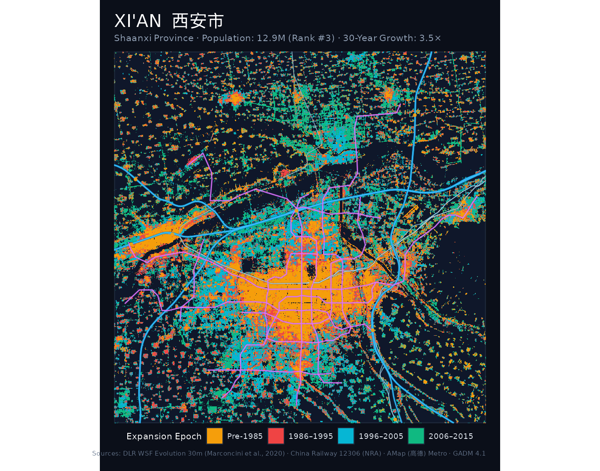
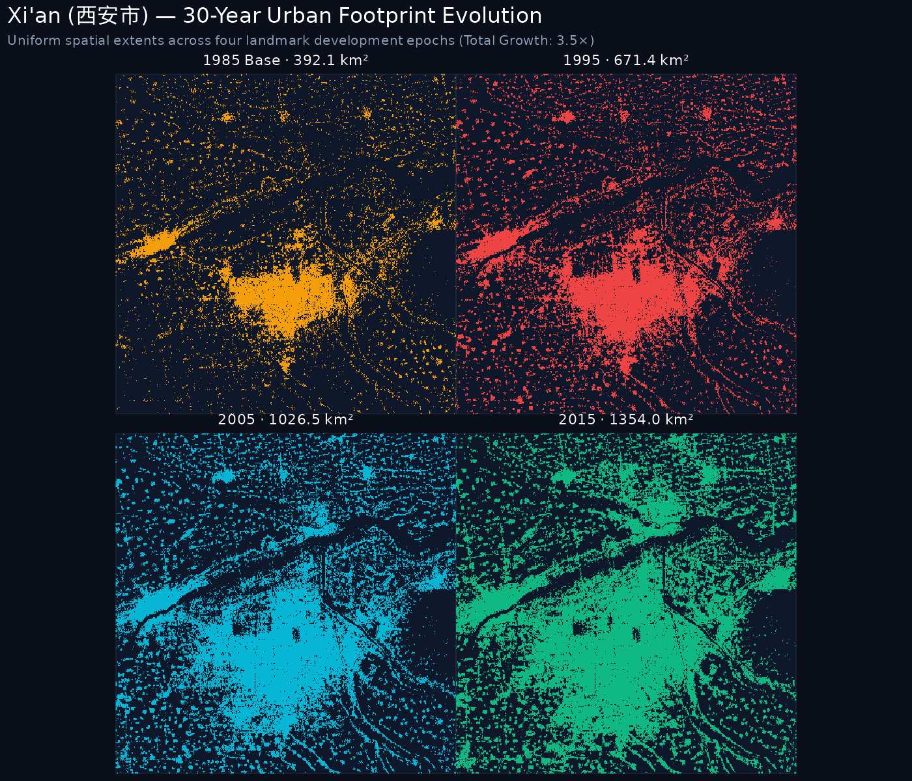
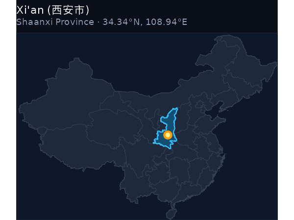
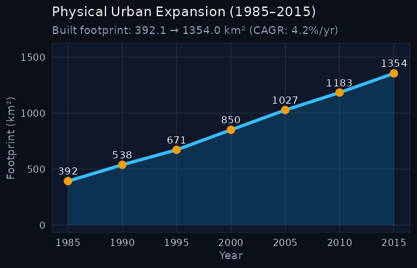

```{=html}
<div class="hero-banner">
  <div style="display: flex; justify-content: space-between; align-items: flex-start; flex-wrap: wrap; gap: 1rem;">
    <div>
      <h1 class="hero-title" style="margin-bottom: 0.25rem;">Xi'an <span style="color: #1e3f34; font-style: normal; font-weight: normal;">西安市</span> <span class="metric-badge badge-blue" style="font-size: 0.85rem; margin-left: 0.5rem;">🚇 12 Metro Lines</span></h1>
      <p style="color: #5e524a; font-size: 1.1rem; margin: 0; font-style: italic;">Xī'ān · Shaanxi (陕西省) · Western Frontier & Steppe</p>
      <p style="color: #221d1a; font-size: 0.95rem; margin-top: 0.35rem;">
        Permanent population: <strong>12.95 million</strong> (2020 census) · 
        Population rank: <strong>#3</strong> of 47 · 
        ArcGIS urban hierarchy rank: <strong>N/A</strong> · 
        DianPing/commercial index rank: <strong>#9</strong>
      </p>
      <div style="margin-top: 0.75rem; display: flex; flex-wrap: wrap; gap: 0.5rem;">
        <a href="https://en.wikipedia.org/wiki/Xi%27an" target="_blank" rel="noopener" class="resource-btn">Wikipedia (EN)</a>
        <a href="https://zh.wikipedia.org/wiki/%E8%A5%BF%E5%AE%89%E5%B8%82" target="_blank" rel="noopener" class="resource-btn">维基百科 (ZH)</a>
        <a href="https://www.wikidata.org/wiki/Q5826" target="_blank" rel="noopener" class="resource-btn">Wikidata (Q5826)</a>
        <a href="https://commons.wikimedia.org/wiki/Category%3AMaps%20of%20Xi%27an" target="_blank" rel="noopener" class="resource-btn">Wikimedia Commons</a>
        <a href="https://commons.wikimedia.org/w/index.php?search=Xi%27an+map&title=Special:MediaSearch&type=image" target="_blank" rel="noopener" class="resource-btn">Scanned maps search</a>
        <a href="https://drive.google.com/drive/folders/1b-HupghVS7KQn4ZTvGjfOHFFMgPnH2KV?usp=sharing" target="_blank" rel="noopener" class="resource-btn" style="background: #e8ded1; border-color: #943324; font-weight: 600;">AGSL map scans archive ↗</a>
        <a href="https://ucsb.maps.arcgis.com/home/item.html?id=636bb82ea14944a5b719fc46cf055a53#overview" target="_blank" rel="noopener" class="resource-btn" style="background: #e8ded1; border-color: #943324; font-weight: 600;">UCSB Esri Web Map ↗</a>
      </div>
    </div>
    <div style="text-align: right;">
      <span class="metric-badge badge-gold" style="font-size: 1.1rem; padding: 0.5rem 1rem;">3.45× growth multiple</span>
    </div>
  </div>
</div>
```

## 1. The urban growth rings (1985–2015)

The cartographic monograph below documents the physical settlement rings of **Xi'an** across four historical development epochs:

- <span style="color: #c75c3d; font-weight: bold;">● Pre-1985 Core</span>: Historic urban core and initial post-1949 industrial settlements.
- <span style="color: #2e5a48; font-weight: bold;">● 1986–1995 Wave</span>: Early reform, opening up, and Deng Xiaoping's 1992 Southern Tour (*Nanxun*).
- <span style="color: #457b9d; font-weight: bold;">● 1996–2005 Wave</span>: WTO entry, export industrialization, and new development zones (*Kaifaqu*).
- <span style="color: #e9c46a; font-weight: bold;">● 2006–2015 Wave</span>: High-speed rail expansion, modern new cities (*Xinqu*), and peri-urban consolidation.

::: {.map-container}

:::

::: {.callout-tip title="Rapid Transit & Municipal Metro Infrastructure"}
**Xi'an** operates an extensive urban rapid transit network comprising **12 operational metro lines** and **247 passenger stations** (source: AMap 高德地图 / Ministry of Transport of the PRC):

- **Key metro corridors**: `地铁1号线`, `地铁2号线`, `地铁3号线`, `地铁4号线`, `地铁5号线`, `地铁6号线`, `地铁8号(环)线`, `地铁9号线`
- **Cartographic overlay**: Illustrated on the main poster above, connecting historical settlement cores with peripheral development zones.
- **Transit alignment**: High-frequency metro corridors provide multi-directional connectivity between the historical core (Pre-1985 settlement) and outer-ring state-level expansion zones (*Kaifaqu* and *Xinqu*).
:::


```{=html}
<div class="agsl-box">
  <div class="agsl-title">Archival cartography: AGSL historical map scans</div>
  <div class="agsl-desc">
    The following high-resolution archival sheets and historical surveys from the <strong>American Geographical Society Library (AGSL)</strong> collection directly cover <strong>Xi'an</strong> and its surrounding territorial hinterland:
  </div>
  <div class="agsl-grid">
    <div class="agsl-card">
      <div>
        <a href="https://drive.google.com/file/d/1ljT3I3TUCV9OVVqkR9TfBSjWkVP8qED6/view?usp=drive_web" target="_blank" rel="noopener">📄 Xian 1986</a>
      </div>
      <span class="agsl-tag">AGSL Scan</span>
    </div>
    <div class="agsl-card">
      <div>
        <a href="https://drive.google.com/file/d/1qm8Y9X9nYXy5yrnQ-znDxsd27MHFuMtO/view?usp=drive_web" target="_blank" rel="noopener">📄 Xian 2000</a>
      </div>
      <span class="agsl-tag">AGSL Scan</span>
    </div>
    <div class="agsl-card">
      <div>
        <a href="https://drive.google.com/file/d/1tRPHvtNe7RJ97h_m0tBjW0DAdbQ0IpbU/view?usp=drive_web" target="_blank" rel="noopener">📄 Xian not trans 1989</a>
      </div>
      <span class="agsl-tag">AGSL Scan</span>
    </div>
    <div class="agsl-card">
      <div>
        <a href="https://drive.google.com/file/d/1-WY3AuZpFHpvc0XskvIbK_gtPJ1uwLAx/view?usp=drive_web" target="_blank" rel="noopener">📄 Xian vs 1986</a>
      </div>
      <span class="agsl-tag">AGSL Scan</span>
    </div>
    <div class="agsl-card">
      <div>
        <a href="https://drive.google.com/file/d/1zkkQemf0prYbxTj3SnxYmmCG7lwXiuG5/view?usp=drive_web" target="_blank" rel="noopener">📄 Xian vs 1989</a>
      </div>
      <span class="agsl-tag">AGSL Scan</span>
    </div>
    <div class="agsl-card">
      <div>
        <a href="https://drive.google.com/file/d/1fZ1SlMbOU7OKpsIVMHCaYB12nKwo2T8V/view?usp=drive_web" target="_blank" rel="noopener">📄 Xian vs 2000</a>
      </div>
      <span class="agsl-tag">AGSL Scan</span>
    </div>
  </div>
  <div style="margin-top: 1rem; display: flex; gap: 0.5rem; flex-wrap: wrap;">
    <a href="https://drive.google.com/drive/folders/1b-HupghVS7KQn4ZTvGjfOHFFMgPnH2KV?usp=sharing" target="_blank" rel="noopener" class="resource-btn" style="font-weight: 600;">Browse complete AGSL archive on Google Drive (67 total scans) →</a>
    <a href="https://ucsb.maps.arcgis.com/home/item.html?id=636bb82ea14944a5b719fc46cf055a53#overview" target="_blank" rel="noopener" class="resource-btn" style="background: #e8ded1; border-color: #943324; font-weight: 600;">Explore UCSB ArcGIS Web Map (post-AGSL) ↗</a>
  </div>
</div>
```

---

## 2. Four-epoch footprint progression

Uniform-scale physical footprint progression maps tracking built-up settlement expansion over time:

::: {.map-container}

:::

---

## 3. Geographical location & expansion trajectory

:::: {.columns}

::: {.column width="48%"}
### Location in China
::: {.map-container}

:::
:::

::: {.column width="4%"}
:::

::: {.column width="48%"}
### Thirty-year expansion curve
::: {.map-container}

:::
:::

::::

---

## 4. Urban expansion & hierarchy indicators

::: {.metric-grid}
::: {.metric-card}
::: {.metric-label}
2020 Population
:::
::: {.metric-val}
12.95 <span style="font-size: 1rem; color: #5e524a;">M</span>
:::
<div style="font-size: 0.8rem; color: #943324;">Pop Rank #3 of 47</div>
:::

::: {.metric-card}
::: {.metric-label}
ArcGIS City Rank
:::
::: {.metric-val}
N/A
:::
<div style="font-size: 0.8rem; color: #5e524a;">National Big Cities Tier</div>
:::

::: {.metric-card}
::: {.metric-label}
Commercial Index Rank
:::
::: {.metric-val}
#9
:::
<div style="font-size: 0.8rem; color: #5e524a;">UCSB Study Cities Index</div>
:::

::: {.metric-card}
::: {.metric-label}
1985 Baseline Area
:::
::: {.metric-val}
392.14 <span style="font-size: 1rem; color: #5e524a;">km²</span>
:::
:::

::: {.metric-card}
::: {.metric-label}
2015 Urban Footprint
:::
::: {.metric-val}
1354.03 <span style="font-size: 1rem; color: #5e524a;">km²</span>
:::
<div style="font-size: 0.8rem; color: #1e3f34;">+961.89 km²</div>
:::

::: {.metric-card}
::: {.metric-label}
Growth Multiple
:::
::: {.metric-val}
3.45×
:::
<div style="font-size: 0.8rem; color: #943324;">Multiplier Rank #24</div>
:::

::: {.metric-card}
::: {.metric-label}
Annual Growth (CAGR)
:::
::: {.metric-val}
4.22%
:::
<div style="font-size: 0.8rem; color: #5e524a;">1985–2015</div>
:::
:::

---

## 5. Five-year milestone chronology

| Milestone Year | Urban Footprint (km²) | Growth vs. 1985 Baseline | Share of 2015 Footprint |
|:---:|:---:|:---:|:---:|
| **1985** | 392.14 km² | 1.00× (Baseline) | 29.0% |
| **1990** | 537.78 km² | 1.37× | 39.7% |
| **1995** | 671.39 km² | 1.71× | 49.6% |
| **2000** | 849.73 km² | 2.17× | 62.8% |
| **2005** | 1026.52 km² | 2.62× | 75.8% |
| **2010** | 1182.69 km² | 3.02× | 87.3% |
| **2015** | 1354.03 km² | **3.45×** | 100.0% |

---

## 6. Archival cartography & wiki resources

Direct links to open knowledge, semantic geodata, and scanned map collections for **Xi'an**:

- 📖 **English Wikipedia**: [Xi'an](https://en.wikipedia.org/wiki/Xi%27an) — In-depth overview of history, urban development, demographic shifts, and regional governance.
- 🌐 **Chinese Wikipedia (中文维基百科)**: [西安市](https://zh.wikipedia.org/wiki/%E8%A5%BF%E5%AE%89%E5%B8%82) — Authoritative municipal boundaries, administrative subdivisions, and local transport infrastructure.
- 🏷️ **Wikidata Knowledge Base**: [Q5826 (Xi'an)](https://www.wikidata.org/wiki/Q5826) — Semantic knowledge graph entity with geocoordinates, OpenStreetMap tags, and linked administrative entities.
- 🗺️ **Wikimedia Commons Map Repository**: [Category:Maps of Xi'an](https://commons.wikimedia.org/wiki/Category%3AMaps%20of%20Xi%27an) — Community-curated media repository containing thematic, administrative, and transport maps.
- 📜 **Historical maps collection**: [Category:Old maps of Xi'an](https://commons.wikimedia.org/wiki/Category%3AOld%20maps%20of%20Xi%27an) — Scanned historical maps, municipal plans, and early surveys.
- 🔍 **Scanned Maps & Historical Sheets Search**: [Explore scanned bitmap and topographic maps of Xi'an on Wikimedia Commons](https://commons.wikimedia.org/w/index.php?search=Xi%27an+map&title=Special:MediaSearch&type=image)
- 🗄️ **AGSL Historical Map Archive**: [Access Google Drive repository of AGSL scans](https://drive.google.com/drive/folders/1b-HupghVS7KQn4ZTvGjfOHFFMgPnH2KV?usp=sharing)
- 🌐 **UCSB ArcGIS Online Web Map**: [View interactive Web Map (item 636bb82ea14944a5b719fc46cf055a53)](https://ucsb.maps.arcgis.com/home/item.html?id=636bb82ea14944a5b719fc46cf055a53#overview)

::: {.callout-note title="Selected Scanned Historical Maps on Wikimedia Commons"}
The following scanned historical maps and cartographic surveys covering **Xi'an** are accessible on Wikimedia Commons:

- [Dury Atlas Maps 1 and 2 The World](https://commons.wikimedia.org/wiki/File%3ADury%20Atlas%20Maps%201%20and%202%20The%20World.jpg) (Wikimedia Commons scanned asset)
- [Xian-location-MAP-in-Shaanxi-Province-in-China](https://commons.wikimedia.org/wiki/File%3AXian-location-MAP-in-Shaanxi-Province-in-China.jpg) (Wikimedia Commons scanned asset)
- [Location map of Xi'an, Shaanxi](https://commons.wikimedia.org/wiki/File%3ALocation%20map%20of%20Xi%27an%2C%20Shaanxi.png) (Wikimedia Commons scanned asset)

Additional scanned historical maps and topographic sheets can be found via the [Wikimedia Commons Scanned Maps Search](https://commons.wikimedia.org/w/index.php?search=Xi%27an+map&title=Special:MediaSearch&type=image).
:::

---

## 7. Sources & methodology attributions

The quantitative and spatial indicators for **Xi'an** are synthesized from the following primary sources:

1. **Urban Footprint & Built-Up Surface**: German Aerospace Center (DLR) [World Settlement Footprint Evolution (1985–2015)](https://download.geoservice.dlr.de/WSF_EVO/). 30m resolution multi-decadal satellite detection (*Marconcini et al., 2020, Nature Scientific Data*).
2. **Permanent Resident Population**: National Bureau of Statistics of China (NBS), [Seventh National Population Census (第七次全国人口普查 / 七普 2020)](http://www.stats.gov.cn/). Resident population: **12.95M** (National Rank: **#3** of 47).
3. **National Urban Tier Classification**: Esri / [ArcGIS Online Big Cities Points FeatureServer](https://services1.arcgis.com/4TXrdeWh0RyCqPgB/arcgis/rest/services/big_cities_points/FeatureServer), National City Rank: **N/A** of 184 major Chinese cities.
4. **UCSB Study Cities & Curated Layers**: University of California, Santa Barbara (UCSB) [Urban Atlas post-AGSL Web Map](https://ucsb.maps.arcgis.com/home/item.html?id=636bb82ea14944a5b719fc46cf055a53#overview) & [study_cities FeatureServer](https://services1.arcgis.com/4TXrdeWh0RyCqPgB/arcgis/rest/services/study_cities/FeatureServer/0) (DianPing rank: #9, RU topos: `x`, ZH city atlas: `x`, Planet: `x`).
4. **National Railway & Municipal Transit**:
   - **National Passenger Rail Network**: China Railway (中国国家铁路集团 / 12306) and National Railway Administration of China (NRA), covering national high-speed corridors (PDL) and conventional trunk lines.
   - **Urban Subway Network**: AMap (高德地图) Subway Platform and PRC Ministry of Transport (MOT) Urban Rail Transit database (12 lines, 247 stations for Xi'an).
6. **Administrative Boundaries**: [GADM Database of Global Administrative Areas (v4.1)](https://gadm.org/), University of California, Davis.
7. **Archival Cartography & Historical Surveys**: American Geographical Society Library (AGSL) Map Collection & [Wikimedia Foundation](https://www.wikimedia.org/) ([Wikipedia](https://en.wikipedia.org/), [Wikidata](https://www.wikidata.org/), and [Wikimedia Commons](https://commons.wikimedia.org/)).

---

```{=html}
<div style="display: flex; justify-content: space-between; margin-top: 2rem; padding: 1rem; background: #f4efe4; border: 1px solid #d6ccbe; border-radius: 4px;">
  <a href="shenzhen.html" style="color: #943324; text-decoration: none; font-weight: 600;">← Previous: Shenzhen (17.56M)</a>
  <a href="../regions/western_frontier.html" style="color: #1e3f34; text-decoration: none; font-weight: 600;">↑ Western Frontier & Steppe</a>
  <a href="zhengzhou.html" style="color: #943324; text-decoration: none; font-weight: 600;">Next: Zhengzhou (12.6M) →</a>
</div>
```
